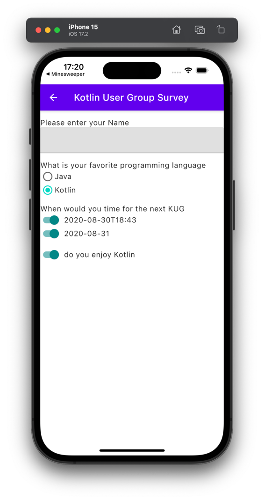
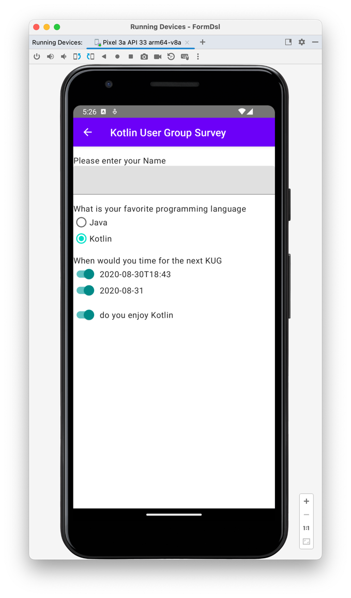
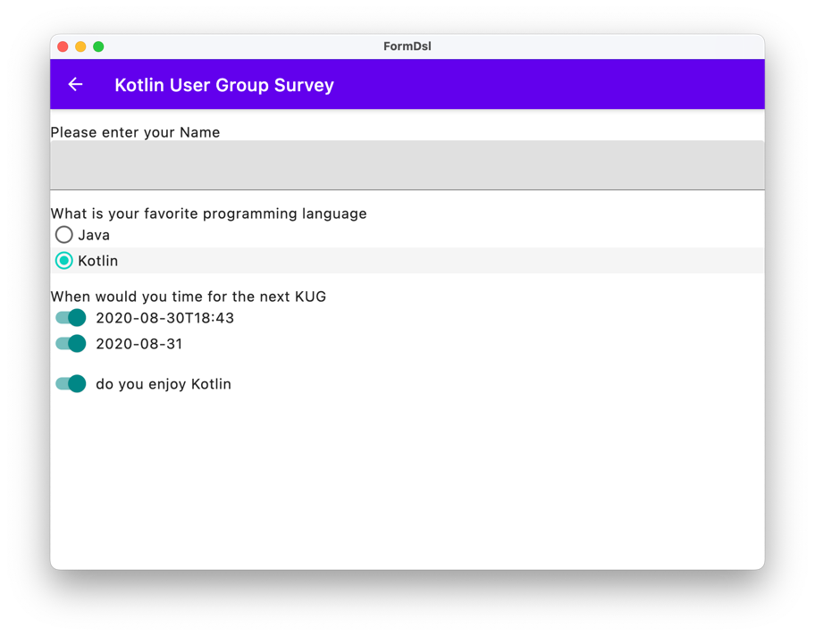

# FormDsl

FormDsl is an example to implement Server Driven Ui for Forms. It is inspired by [KotlinConf 2019: Lona: Scaling Server-driven UI](https://youtu.be/Ir8lq4rSyyc?si=KLpfLwO-yUrep91T).

This is a Kotlin Multiplatform project targeting Android, iOS, Desktop, Server.

## Server Driven UI

If you define a form like this

```kotlin
form {
    id = "65b904b5b4faf94cdd1d5377"
    title = "Kotlin User Group Survey"
    textInput {
        description = "Please enter your Name"
    }
    selectOne {
        description = "What is your favorite programming language"
        defaultValue = "Kotlin"
        option("Java")
        option("Kotlin")
    }
    selectMulti {
        description = "When would you time for the next KUG"
        defaultValue = listOf(
            "2020-08-30T18:43".toLocalDateTime(),
            "2020-08-31".toLocalDate()
        )
        option("2020-08-30T18:43".toLocalDateTime())
        option("2020-08-31".toLocalDate())
    }
    booleanInput {
        id = "enjoyKotlin"
        description = "do you enjoy Kotlin"
        defaultValue = true
    }
}
```

the form get rendered on.
 - IOS



 - Android


 
 - Desktop



and if you fill the form values are saved to mongoDb
```json
{
  "_id": {
    "$oid": "65b92221337ee2407aeb2f29"
  },
  "formId": {
    "$oid": "65b904b5b4faf94cdd1d5377"
  },
  "values": {
    "selectOne0": {
      "_t": "String",
      "value": "Kotlin"
    },
    "selectMulti0": {
      "_t": "List",
      "value": [
        {
          "_t": "LocalDate",
          "value": "2020-08-31"
        }
      ]
    },
    "enjoyKotlin": {
      "_t": "Boolean",
      "value": true
    },
    "textInput0": {
      "_t": "String",
      "value": "Niels Falk"
    }
  },
  "platform": "iOS 17.2",
  "version": {
    "$numberLong": "35"
  }
}
```

## Run the App

 - Run the DB
   - install mongo [install-mongodb-on-os-x](https://www.mongodb.com/docs/manual/tutorial/install-mongodb-on-os-x/)
   - start service `brew services start mongodb-community`
 - Run jvm tests
   - `./gradlew :shared:clean :shared:jvmTest :composeApp:clean :composeApp:desktopTest :server:clean :server:test `
 - Run ios tests
   - `./gradlew :composeApp:cleanIosX64Test :composeApp:iosX64Test :shared:cleanIosX64Test :shared:iosX64Test`
 - Run server
   - `./gradlew :server:run`
 - Run desktop App
   - `./gradlew :composeApp:desktopRun -DmainClass=MainKt --quiet`